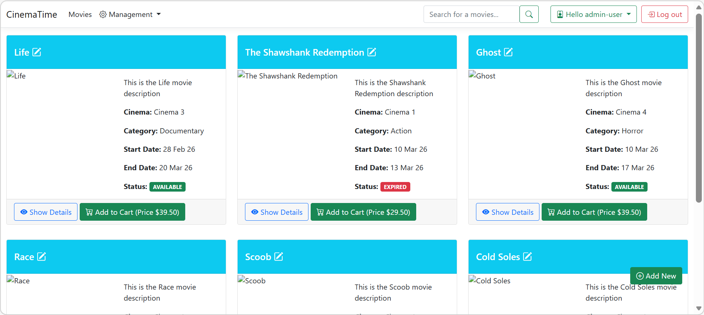

# 🛒 CinemaTime – ASP.NET Core MVC eCommerce Application
Project Link: https://cinematime.azurewebsites.net/

CinemaTime is a full-stack eCommerce web application built using **ASP.NET Core MVC and Entity Framework Core**.  
The application allows users to browse movies, add items to a shopping cart, place orders, and make payments using PayPal.
The project demonstrates key concepts of the ASP.NET Core ecosystem including MVC architecture, dependency injection, authentication, and database management.

---

## 🚀 Features

- User authentication and authorization using **ASP.NET Identity**
- Role-based access (Admin / User)
- Browse movies, cinemas, actors, and producers
- Add movies to shopping cart
- Place and manage orders
- PayPal sandbox payment integration
- Admin dashboard to manage movies, cinemas, actors, and producers
- Search functionality for movies
- Dynamic UI rendering using ViewComponents
- Database seeding and migrations

---

## 🛠️ Tech Stack

**Backend**
- ASP.NET Core MVC
- Entity Framework Core
- ASP.NET Identity

**Database**
- SQL Server

**Frontend**
- Razor Views
- Bootstrap

**Other Technologies**
- Dependency Injection
- Repository Pattern
- ViewComponents
- PayPal Checkout Integration

---

## 🏗️ Architecture

The project follows the **MVC Architecture Pattern**:

- **Models** – Represents application data
- **Views** – UI layer built with Razor
- **Controllers** – Handles application logic and user requests
- **Services & Repositories** – Business logic and data access layer

---

## 📦 Main Functional Modules

- Actor Management
- Producer Management
- Cinema Management
- Movie Catalog
- Shopping Cart
- Orders & Checkout
- Authentication & Role Management

---

## 🔑 Key Concepts Implemented

- MVC design pattern
- Entity Framework Core migrations
- Generic Repository Pattern
- Dependency Injection (Scoped / Transient / Singleton)
- Model validation
- Role-based authorization
- Cookie-based authentication
- PayPal payment gateway integration

---

## 🌐 Deployment

The application is deployed on:

- **Microsoft Azure**
- Database hosted on **Azure SQL**

---

## 📷 Application Demo

---

## 📚 Learning Outcomes

Through this project I gained practical experience in:

- Building a full-stack ASP.NET Core MVC application
- Working with Entity Framework Core and relational databases
- Implementing authentication and authorization
- Integrating third-party payment gateways
- Deploying web applications on Azure

---
